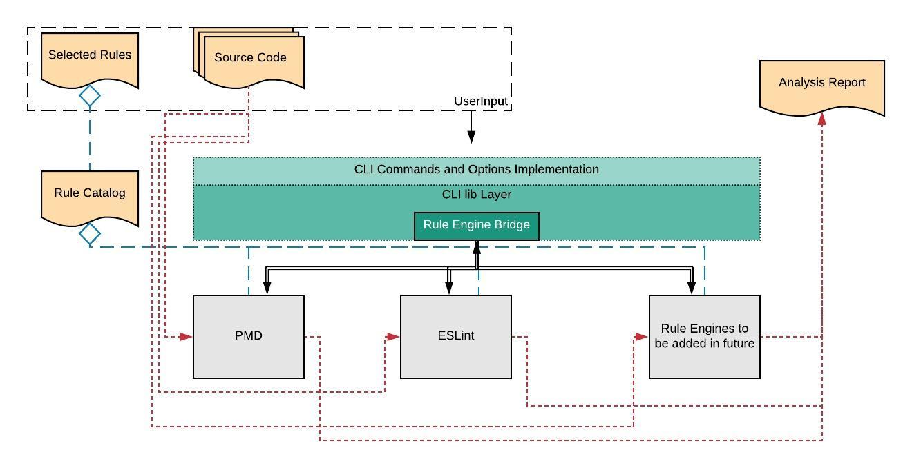

## sfdx-scanner Architecture

sfdx-scanner is an open-source [Salesforce CLI plugin](https://developer.salesforce.com/docs/atlas.en-us.sfdx_cli_plugins.meta/sfdx_cli_plugins/cli_plugins_architecture.htm). Most of the code is written in Typescript in the NodeJS framework. Some of the code is written in Java.

## sfdx-scanner Internals

The sfdx-scanner plug-in is powered by multiple static analyzers, also known as rule engines. These rule engines specialize in different aspects of static analysis and support multiple languages. Each rule engine has its own unique set of rules, input parameters, and formats for reporting the results. The sfdx-scanner plug-in unifies these rules engines as a single static analyzer and provides a common user experience to benefit from the different specialties.

Version 2.0 of the sfdx-scanner plug-in uses PMD v6.23.0 and ESlint v6.8.0.

-------



-------

## Rule Engine Unification

To provide a uniform experience while using multiple rule engines, sfdx-scanner has two bridging blocks.

### Rule Catalog

Each rule engine has a different set of rules and different formats for representing them. The sfdx-scanner plug-in communicates with each rule engine separately to pull the default rules they offer and populate them together in the rule catalog. This catalog contains the name of a rule, a short description, its classification category, and the code source language that the rule can analyze. Run the ```scanner:rule:list``` command to view this catalog. The output includes the rule engine name that a particular rule belongs to.

### Rule Engine Bridge

By unifying the representation of the rules into a rule catalog, sfdx-scanner can take a uniform set of input parameters. The bridge then detects the selected engines using the rules selected for input. It also determines the target files based on the file types defined in ```~/.sfdx-scanner/Config.json```. From the selected rules and target files, it tailors the input for each relevant rule engine and hands off the input to the rule engine for the actual scan.

After the scan completes and the rule engine provides the results, the bridge surfaces the results in a normalized format.

## Source Code and Contribution

The code for the sfdx-scanner plug-in is in [this GitHub repo](https://github.com/forcedotcom/sfdx-scanner). Salesforce is actively working on expanding and improving the tool. The project will soon be open for external contributions.


